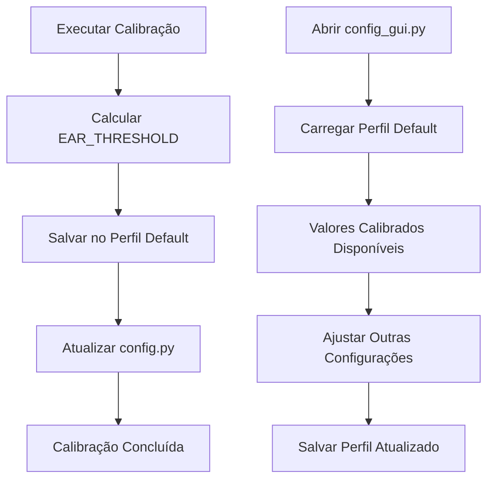

# Integração Calibração-Perfil

Este documento explica como a calibração do Pisk&Click se integra automaticamente com o sistema de perfis do `config_gui.py`.

## 📋 Visão Geral

A partir desta implementação, quando você executa uma calibração:

1. ✅ Os resultados são salvos automaticamente no **perfil default**
2. ✅ O perfil default é **criado automaticamente** se não existir
3. ✅ Todas as configurações existentes são **preservadas**
4. ✅ Apenas o `EAR_THRESHOLD` é atualizado com o resultado da calibração
5. ✅ O `config.py` também é atualizado para compatibilidade

## 🔧 Como Funciona

### Antes da Integração
- Calibração salvava apenas no `config.py`
- Perfis e calibração eram sistemas separados
- Era necessário configurar manualmente o perfil

### Depois da Integração
- Calibração salva **automaticamente** no perfil default
- Sistema de perfis e calibração trabalham juntos
- Interface gráfica (`config_gui.py`) carrega automaticamente os valores calibrados

## 🚀 Como Usar

### 1. Executar Calibração

```python
# Método 1: Usando o main.py
python main.py
# Pressione 'c' para calibrar

# Método 2: Usando calibração direta
from main import FaceController
from calibration_module import CalibrationModule

face_controller = FaceController()
calibration_module = CalibrationModule(face_controller)
results = calibration_module.run_calibration()
```

### 2. Usar Interface Gráfica

```python
# Executar interface gráfica
python config_gui.py

# O perfil "default" já terá os valores calibrados carregados!
```

### 3. Verificar Integração

```python
# Executar teste de integração
python test_calibration_profile_integration.py

# Executar exemplo prático
python exemplo_calibracao_perfil.py
```

## 📁 Estrutura de Arquivos

### Perfil Default (`profiles/default.json`)
```json
{
    "REFINE_LANDMARKS": true,
    "EAR_THRESHOLD": 0.25,  // ← Atualizado pela calibração
    "BLINK_CONSECUTIVE_FRAMES": 1,
    "SMOOTHING_FACTOR": 0.29,
    "CONTROL_AREA_X_MIN": 0.3,
    "CONTROL_AREA_X_MAX": 0.61,
    "CONTROL_AREA_Y_MIN": 0.3,
    "CONTROL_AREA_Y_MAX": 0.7,
    "INVERT_X_AXIS": false,
    "INVERT_Y_AXIS": false,
    "CLICK_DEBOUNCE_TIME": 0.2,
    "PROCESS_EVERY_N_FRAMES": 1
}
```

### Config.py (Atualizado Automaticamente)
```python
# Valores atualizados pela calibração
EAR_THRESHOLD = 0.25  # ← Mesmo valor do perfil
# ... outras configurações
```

## 🔄 Fluxo de Integração



## 🛠️ Modificações Implementadas

### 1. CalibrationModule
- ✅ Sempre inicializa com `UserProfileManager`
- ✅ Salva automaticamente no perfil default
- ✅ Cria perfil se não existir
- ✅ Preserva configurações existentes

### 2. ConfigManager
- ✅ Integração automática com sistema de perfis
- ✅ Logs detalhados do processo de salvamento
- ✅ Tratamento de erros melhorado

### 3. Compatibilidade
- ✅ 100% compatível com `config_gui.py`
- ✅ Mantém compatibilidade com `config.py`
- ✅ Não quebra funcionalidades existentes

## 📊 Testes de Validação

### Teste de Integração
```bash
python test_calibration_profile_integration.py
```

**Verifica:**
- ✅ Salvamento no perfil default
- ✅ Atualização do config.py
- ✅ Compatibilidade com config_gui.py
- ✅ Preservação de configurações existentes

### Exemplo Prático
```bash
python exemplo_calibracao_perfil.py
```

**Demonstra:**
- 🎯 Calibração completa com integração
- 📋 Carregamento do perfil calibrado
- 🖥️ Uso com interface gráfica

## 🎯 Benefícios

### Para o Usuário
- 🚀 **Processo simplificado**: Calibra uma vez, usa em qualquer lugar
- 🔄 **Sincronização automática**: Perfil e calibração sempre alinhados
- 🎛️ **Interface unificada**: Tudo acessível via config_gui.py
- 💾 **Persistência**: Configurações salvas automaticamente

### Para o Desenvolvedor
- 🧩 **Modularidade**: Sistemas integrados mas independentes
- 🛡️ **Robustez**: Tratamento de erros e fallbacks
- 📝 **Rastreabilidade**: Logs detalhados de todo o processo
- 🔧 **Manutenibilidade**: Código organizado e documentado

## 🚨 Notas Importantes

### Compatibilidade
- ✅ **Retrocompatível**: Funciona com código existente
- ✅ **Não destrutivo**: Preserva configurações manuais
- ✅ **Flexível**: Permite sobrescrever valores se necessário

### Limitações
- ⚠️ **Perfil fixo**: Sempre salva no perfil "default"
- ⚠️ **Campo único**: Apenas `EAR_THRESHOLD` é atualizado pela calibração
- ⚠️ **Dependência**: Requer `user_profile_manager.py`

## 🔮 Próximos Passos

### Melhorias Futuras
1. **Calibração de múltiplos parâmetros**
   - Calibrar `SMOOTHING_FACTOR`
   - Calibrar `BLINK_CONSECUTIVE_FRAMES`
   - Calibrar áreas de controle

2. **Perfis múltiplos**
   - Permitir escolher perfil de destino
   - Calibração específica por usuário
   - Perfis para diferentes condições

3. **Interface aprimorada**
   - Botão de calibração no config_gui.py
   - Visualização em tempo real dos valores
   - Histórico de calibrações

## 📞 Suporte

Se você encontrar problemas:

1. **Execute os testes**: `python test_calibration_profile_integration.py`
2. **Verifique os logs**: Procure por mensagens de erro detalhadas
3. **Verifique arquivos**: Confirme que `profiles/default.json` existe
4. **Teste o exemplo**: Execute `python exemplo_calibracao_perfil.py`

---

**✨ A integração está completa e funcionando! Agora calibração e perfis trabalham juntos perfeitamente. ✨**